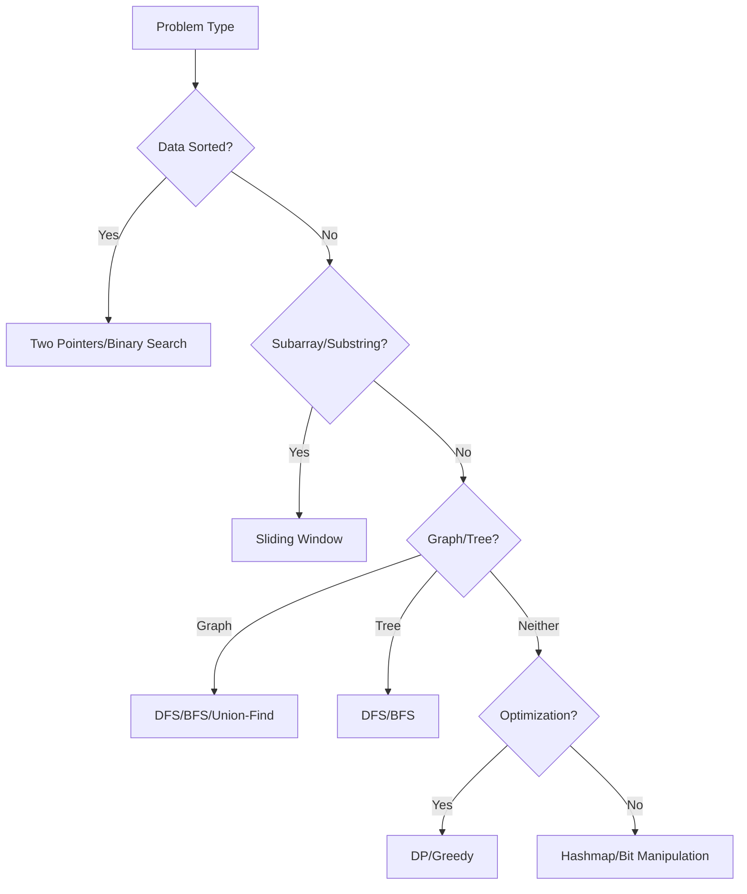

# DSA Pattern Cheat Sheet

## 🎯 Array Techniques

- **Sorted array?** → Two pointers (meet-in-middle for pair sums)
- **Elements in [1,N]?** → Cyclic sort (find missing/duplicate numbers in O(n))
- **Max/min subarray?** → Sliding window (contiguous) or Kadane's (sum)
- **Frequency counting?** → Hashmap (or array as freq table for small integers)
- **Rotated sorted array?** → Modified binary search (find pivot point)

## 🔗 Linked List Tricks

- **Cycle detection?** → Floyd's (slow/fast pointers)
- **Reverse list?** → Three-pointer dance (prev, curr, next)
- **Kth from end?** → Fast pointer with K-node head start
- **Palindrome check?** → Reverse second half + compare

## 📊 Stack Patterns

- **Nested structures?** → Use for parenthesis/braces validation
- **Next greater element?** → Monotonic decreasing stack
- **DFS?** → Stack (iterative) or recursion (implicit stack)

## 🌳 Tree Strategies

- **BST property?** → Inorder traversal gives sorted order
- **Path sum?** → DFS with backtracking (carry sum downward)
- **Level order?** → BFS with queue (track level size)
- **LCA?** → Recursive "search both subtrees" approach

## 🕸 Graph Tactics

- **Shortest path (unweighted)?** → BFS with queue
- **Weighted edges?** → Dijkstra's (min-heap) for non-negative weights
- **Detect cycle?** → DFS with visited set (or Union-Find for undirected)
- **Connected components?** → Union-Find or DFS/BFS traversal

## ⚡ Hashing Hints

- **Subarray sum = K?** → Prefix sum + hashmap (stores sum→index)
- **Duplicate detection?** → HashSet for O(1) lookups
- **Anagrams?** → Frequency array (size 26/256) or sorted key

## 🔍 Binary Search Clues

- **Sorted data?** → Classic binary search (mid = low + (high-low)/2)
- **Rotated array?** → Find pivot first, then search halves
- **Monotonic function?** → Binary search on answer space

## 🧠 DP Insights

- **"How many ways?"** → Often combinatorial DP (e.g., climb stairs)
- **String matching?** → 2D DP table (rows=pattern, cols=text)
- **Knapsack?** → dp[i][w] = max value for weight w
- **Memoization tip** → Use @lru_cache in Python for recursive DP

## 🌀 Bit Magic

- **Single number?** → XOR all elements (a^a = 0)
- **Count 1s?** → n & (n-1) trick (flips last set bit)
- **Power of two?** → n & (n-1) == 0

## 🧩 Greedy Signs

- **"Optimal selection"?** → Sort first then pick locally best
- **Interval problems?** → Sort by end time for max non-overlapping
- **Huffman coding?** → Always merge smallest frequencies

## 🛠 Utility Techniques

- **Monotonic queue** → Maintain max/min in sliding window
- **Quickselect** → O(n) kth smallest (modified quicksort)
- **Flood fill** → DFS/BFS for connected regions

# 🚀 Problem-Solving Flowchart

1. **Input size?**

   - Large (10^5+): O(n) or O(nlogn) only
   - Tiny (n≤20): Backtracking/bitmask may work

2. **Pattern match**:

   - "Find pairs" → Two pointers/hashmap
   - "All combinations" → Backtracking
   - "Min/max path" → BFS/Dijkstra/DP

3. **Optimize**:
   - Pre-sort if allowed
   - Memoize repeated computations
   - Early termination when possible

# Pro Tips

- Sort First: Enables two pointers/binary search (50% of array problems)
- Hash Everything: Frequency counting solves 30% of string/array problems
- DFS vs BFS: DFS for paths/exhaustive search, BFS for shortest path
- DP Test: Check for 1) Optimal substructure 2) Overlapping subproblems
- Greedy Check: Can local optimal choices guarantee global optimum?

# Algorithmic Techniques Cheat Sheet

## 1. Two Pointers

- **When to Use**:
  - Sorted array problems ("pair sum", "remove duplicates")
  - Linked list cycles (Floyd's algo)
  - Partitioning arrays ("move zeros", "Dutch flag")
- **Triggers**:
  > "Find pairs in sorted array"  
  > "In-place rearrangement"  
  > "Cycle detection"

## 2. Sliding Window

- **When to Use**:
  - Contiguous subarrays/substrings ("max sum", "longest substring with K distinct chars")
  - Fixed-size window problems ("max in all K-sized windows")
- **Triggers**:
  > "Contiguous subarray"  
  > "Window of size K"  
  > "Minimum/maximum in substring"

## 3. Binary Search

- **When to Use**:
  - Sorted data search ("find first bad version")
  - Monotonic function minimization ("capacity to ship packages")
  - Rotated array problems ("search in rotated array")
- **Triggers**:
  > "Sorted array"  
  > "Find minimum/maximum X where condition holds"  
  > "O(log n) required"

## 4. Depth-First Search (DFS)

- **When to Use**:
  - Exhaustive path exploration ("all permutations")
  - Tree path problems ("path sum", "LCA")
  - Backtracking ("N-queens", "Sudoku")
- **Triggers**:
  > "All possible combinations"  
  > "Explore all paths"  
  > "Decision tree problems"

## 5. Breadth-First Search (BFS)

- **When to Use**:
  - Shortest path in unweighted graphs
  - Level-order traversal ("tree level order")
  - Flood fill ("number of islands")
- **Triggers**:
  > "Shortest path"  
  > "Level-by-level processing"  
  > "Nearest neighbor problems"

## 6. Dynamic Programming

- **When to Use**:
  - Optimization problems ("knapsack", "coin change")
  - Counting problems ("unique paths")
  - String matching ("edit distance", "LCS")
- **Triggers**:
  > "How many ways?"  
  > "Minimum/maximum cost"  
  > "Overlapping subproblems"

## 7. Greedy Algorithms

- **When to Use**:
  - Interval scheduling ("activity selection")
  - Coin change (with special denominations)
  - Huffman coding
- **Triggers**:
  > "Make optimal local choices"  
  > "Interval problems"  
  > "No need to backtrack"

## 8. Union-Find

- **When to Use**:
  - Dynamic connectivity ("friends in social network")
  - Cycle detection in undirected graphs
  - Kruskal's MST algorithm
- **Triggers**:
  > "Connected components"  
  > "Merge sets efficiently"  
  > "Incremental graph connections"

## 9. Topological Sort

- **When to Use**:
  - Task scheduling ("course prerequisites")
  - Dependency resolution
  - DAG linearization
- **Triggers**:
  > "Order dependencies"  
  > "Before/after constraints"  
  > "Directed acyclic graph (DAG)"

## 10. Bit Manipulation

- **When to Use**:
  - Compact representation ("subset generation")
  - XOR tricks ("single number")
  - Optimizations ("power of two check")
- **Triggers**:
  > "Space optimization needed"  
  > "Unique number detection"  
  > "Subset problems"

# Technique Selection Flowchart

